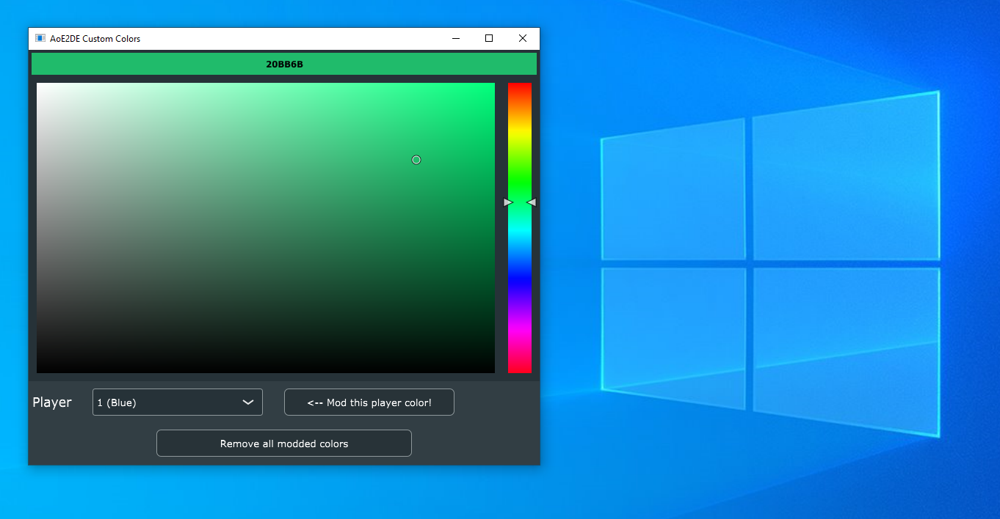

# aoe2-color-tool
A tool to easily modify player colors in Age of Empires II: Definitive Edition



## Just here to use the tool?

See [releases page](https://github.com/TheWaveWarden/aoe2-color-tool/releases) to the right and download the latest `AoE2ColorTool.zip` if you just want to download the tool.

## Building the tool from source
This tool uses JUCE and C++ to build a standalone modding tool. Please make sure you have installed:
- git
- CMake
- Visual Studio Community

Open a terminal and clone this repo **with submodules**
```
git clone git@github.com:TheWaveWarden/aoe2-color-tool.git --recurse-submodules
cd aoe2-color-tool
```

Configure the project
```
cmake -B build -D CMAKE_BUILD_TYPE=Debug
```

Build the project
```
cmake --build build --config Debug
```
