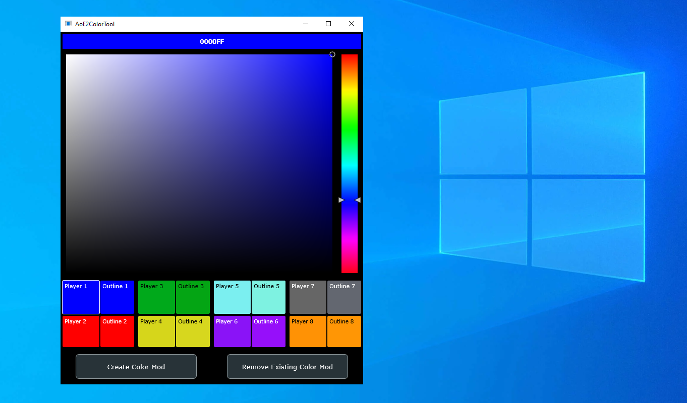

# === WARNING ===
As of the latest build of AoE2:DE (09/2022), this tool doesn't seem to work anymore.

# aoe2-color-tool
A tool to easily modify player colors in Age of Empires II: Definitive Edition



The current executable is found in the directory
```
Builds/VisualStudio2019/x64/Release/App/AoE2 Custom Colors.exe
```
